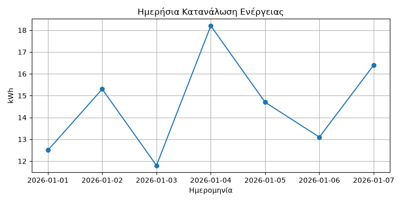

# ⚡ Energy Consumption Analyzer

A Python application that analyzes daily electricity consumption using **Pandas** and **Matplotlib**.

---

## 📷 Chart Preview



---

## ✨ Features

- 📂 Reads energy data from a CSV file
- 📊 Calculates:
  - Total consumption
  - Average consumption
  - Maximum consumption
  - Minimum consumption
- 📅 Finds the day with the highest energy usage
- 💰 Calculates electricity cost
- ⚠️ Detects high-consumption days
- 📈 Generates and saves a line chart

---

## 🛠 Technologies

- Python 3
- Pandas
- Matplotlib
- Git
- GitHub

---

## 📁 Project Structure

```text
energy-consumption-analyzer/
│
├── images/
│   └── energy_consumption_chart.png
│
├── energy_data.csv
├── main.py
├── README.md
└── requirements.txt
```

---

## 🚀 Installation

```bash
pip install -r requirements.txt
```

Run:

```bash
python main.py
```

---

## 📊 Example Output

```text
----- STATISTICS -----

Total Consumption: 102.00 kWh
Average Consumption: 14.57 kWh
Maximum Consumption: 18.20 kWh
Minimum Consumption: 11.80 kWh

Total Cost: 18.36 €
```

---

## 👨‍💻 Author

**Giorgos Gkontevas**